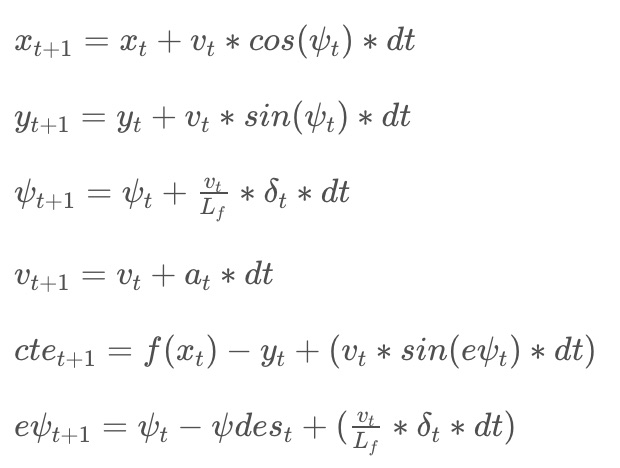

### The Model

For this project, we used a Global Kinematic Model, which is just a simplification of a dynamic model.

The state in this model encompasses: [x, y, psi, v, cte, epsi], as discussed in Lesson 18: Vehicle Models.
  - `x` and `y` coordinates are of the vehicle's position
  - `psi` refers to the orientation angle of the vehicle
  - `v` is for vehicle's velocity
  - `cte` represents the cross track error.
  - `epsi` represents the psi (orientation) error.

Technically, there are 3 actuators: steering wheel, throttle pedal, and the brake. In our project though, we consider the throttle and brake as a single actuator. Positive values signify acceleration and negative values signify braking.

Our model combines the state and actuations from the previous timestep to calculate the state for the current timestep based on the equations below:



### Timestep Length and Elapsed Duration (N & dt)
The values chosen for `N` and `dt` were 10 and 0.1. These were initially provided from the [Udacity Youtube Video](https://www.youtube.com/watch?v=bOQuhpz3YfU) for this project. The values are essentially considering a one second duraction in which to determine a correct trajectory.

In my code, in `MPC.cpp`, I tried a few other values but both gave very erratic behavior. For instance, I used the initial values provided on the MPC Quiz and the vehicle about a second in, went off the road. So I stuck with the values provided since the instructors simulation ran fairly well.

### Polynomial Fitting and MPC Processing
This was also helpful and provided in the [Udacity Youtube Video](https://www.youtube.com/watch?v=bOQuhpz3YfU). The code addressing this can be found in `main.cpp` in lines 107 - 129. The waypoints are being preprocessed by transforming them to the vehicle's perspective. This, actually simplifies the process to fit a polynomial to the waypoints. The reason being that now the origin is set to `0, 0` as well as the orientation angle (set to 0).

I made additional notes within the lines mentioned based off what the instructors discussed.

### Model Predictive Control w/ Latency
This problem took me a while but fortunately others in the discussion group were helpful for me finding a solution.

Initially, I incorporated (what can be seen in `main.cpp`, lines 99 - 104):

```
px = px + v*cos(psi)*latency;
py = py + v*sin(psi)*latency;
psi = psi + v*delta/Lf*latency;
v = v + acceleration*latency;
```

The above equations would calcualte the car's new `px`, `py`, and `psi` @ latency time and then map the waypoints from global coordinates ot the car's coordinates. The issue was that the car would still go in circles, immediatly going over the curb.

With some insight from these two discussions:
 - [Here is some advice about steering values](https://discussions.udacity.com/t/here-is-some-advice-about-steering-values/276487/4)
 - [How to incorporate latency into the model](https://discussions.udacity.com/t/how-to-incorporate-latency-into-the-model/257391/4)

 I found that my issue was with `psi`, it involved some misunderstanding with the how the simulator provides the steering_angle.
